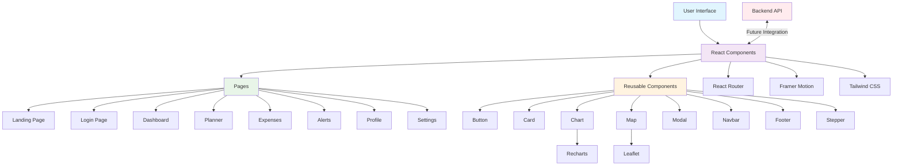
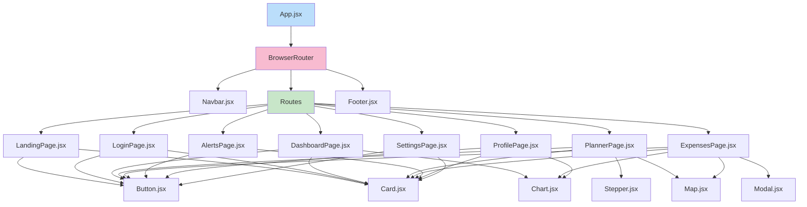
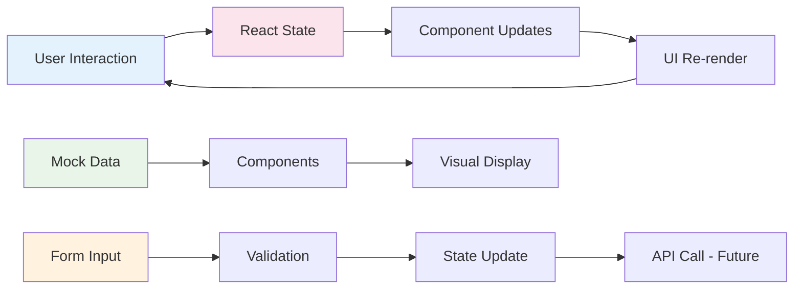
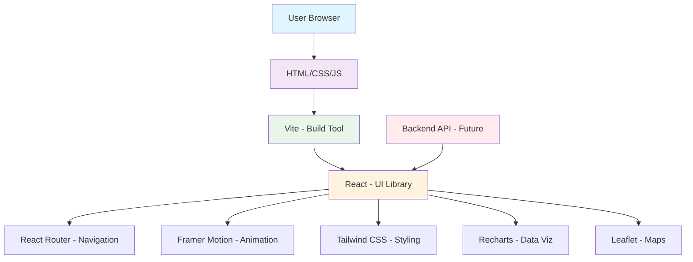

# Seamless-GO Frontend Architecture

```mermaid
graph TB
    A[User Interface] --> B[React Components]
    B --> C[Pages]
    B --> D[Reusable Components]
    C --> E[Landing Page]
    C --> F[Login Page]
    C --> G[Dashboard]
    C --> H[Planner]
    C --> I[Expenses]
    C --> J[Alerts]
    C --> K[Profile]
    C --> L[Settings]
    D --> M[Button]
    D --> N[Card]
    D --> O[Chart]
    D --> P[Map]
    D --> Q[Modal]
    D --> R[Navbar]
    D --> S[Footer]
    D --> T[Stepper]
    
    O --> U[Recharts]
    P --> V[Leaflet]
    
    B --> W[React Router]
    B --> X[Framer Motion]
    B --> Y[Tailwind CSS]
    
    Z[Backend API] <-- Future Integration --> B
    
    style A fill:#e1f5fe
    style B fill:#f3e5f5
    style C fill:#e8f5e8
    style D fill:#fff3e0
    style Z fill:#ffebee
```

## Component Hierarchy

```mermaid
graph TD
    App[App.jsx] --> Router[BrowserRouter]
    Router --> Navbar[Navbar.jsx]
    Router --> Routes[Routes]
    Router --> Footer[Footer.jsx]
    
    Routes --> Landing[LandingPage.jsx]
    Routes --> Login[LoginPage.jsx]
    Routes --> Dashboard[DashboardPage.jsx]
    Routes --> Planner[PlannerPage.jsx]
    Routes --> Expenses[ExpensesPage.jsx]
    Routes --> Alerts[AlertsPage.jsx]
    Routes --> Profile[ProfilePage.jsx]
    Routes --> Settings[SettingsPage.jsx]
    
    Landing --> Button[Button.jsx]
    Landing --> Card[Card.jsx]
    
    Login --> Button
    Login --> Card
    
    Dashboard --> Card
    Dashboard --> Chart[Chart.jsx]
    Dashboard --> Button
    
    Planner --> Card
    Planner --> Stepper[Stepper.jsx]
    Planner --> Button
    Planner --> Map[Map.jsx]
    
    Expenses --> Card
    Expenses --> Chart
    Expenses --> Map
    Expenses --> Modal[Modal.jsx]
    Expenses --> Button
    
    Alerts --> Card
    Alerts --> Button
    
    Profile --> Card
    Profile --> Chart
    Profile --> Button
    
    Settings --> Card
    Settings --> Button
    
    style App fill:#bbdefb
    style Router fill:#f8bbd0
    style Routes fill:#c8e6c9
```

## Data Flow

```mermaid
graph LR
    A[User Interaction] --> B[React State]
    B --> C[Component Updates]
    C --> D[UI Re-render]
    D --> A
    
    E[Mock Data] --> F[Components]
    F --> G[Visual Display]
    
    H[Form Input] --> I[Validation]
    I --> J[State Update]
    J --> K[API Call - Future]
    
    style A fill:#e3f2fd
    style B fill:#fce4ec
    style E fill:#e8f5e8
    style H fill:#fff3e0
```

## Technology Stack Layers

```mermaid
graph TD
    A[User Browser] --> B[HTML/CSS/JS]
    B --> C[Vite - Build Tool]
    C --> D[React - UI Library]
    D --> E[React Router - Navigation]
    D --> F[Framer Motion - Animation]
    D --> G[Tailwind CSS - Styling]
    D --> H[Recharts - Data Viz]
    D --> I[Leaflet - Maps]
    
    J[Backend API - Future] --> D
    
    style A fill:#e1f5fe
    style B fill:#f3e5f5
    style C fill:#e8f5e8
    style D fill:#fff3e0
    style J fill:#ffebee
```