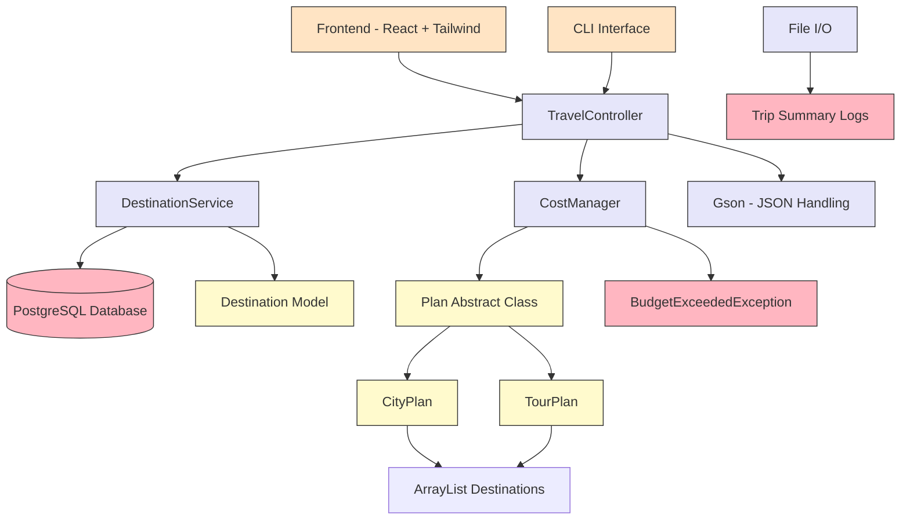

```mermaid
graph TD
    A[Frontend - React + Tailwind] --> B[TravelController]
    B --> C[DestinationService]
    B --> D[CostManager]
    C --> E[(PostgreSQL Database)]
    C --> F[Destination Model]
    D --> G[Plan Abstract Class]
    G --> H[CityPlan]
    G --> I[TourPlan]
    H --> J[ArrayList Destinations]
    I --> J
    D --> K[BudgetExceededException]
    B --> L[Gson - JSON Handling]
    M[CLI Interface] --> B
    N[File I/O] --> O[Trip Summary Logs]
    
    style A fill:#ffe4c4,stroke:#333
    style B fill:#e6e6fa,stroke:#333
    style C fill:#e6e6fa,stroke:#333
    style D fill:#e6e6fa,stroke:#333
    style E fill:#ffb6c1,stroke:#333
    style F fill:#fffacd,stroke:#333
    style G fill:#fffacd,stroke:#333
    style H fill:#fffacd,stroke:#333
    style I fill:#fffacd,stroke:#333
    style K fill:#ffb6c1,stroke:#333
    style L fill:#e6e6fa,stroke:#333
    style M fill:#ffe4c4,stroke:#333
    style N fill:#e6e6fa,stroke:#333
    style O fill:#ffb6c1,stroke:#333
```